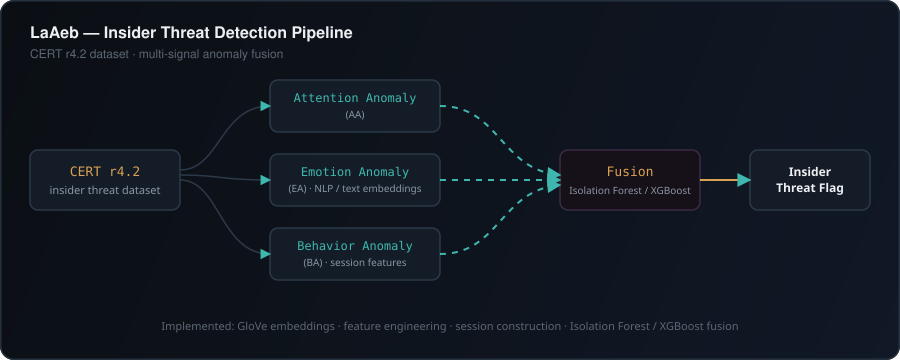

<div align="center">



<br/>

### Cybersecurity Engineer · Data Scientist · AI Security Researcher

**Enterprise Security → Data Science → AI for Cybersecurity**

<br/>

<a href="http://www.linkedin.com/in/enggr-muhammad-bilal">
  
</a>
&nbsp;
<a href="mailto:Engr.MuhammadBilal97@Gmail.com">
  
</a>
&nbsp;


</div>


# Who I am

I'm a **Cybersecurity Engineer and Data Scientist** with 5+ years of experience across enterprise security engineering, privileged access management, security operations, network security, and technical presales.

My professional career started with infrastructure and network security and grew into enterprise security engineering — designing and delivering **PAM, SIEM, SOAR, EDR, and vulnerability-management solutions** for customers across on-premises and cloud environments.

I am now extending that security background into **data science and AI**, focusing on how machine learning, NLP, behavioral analytics, and anomaly detection can improve cybersecurity decision-making.

### My focus

```text
Enterprise Cybersecurity
        │
        ├── PAM / Identity Security
        ├── SIEM / Security Operations
        ├── SOAR / Automation
        ├── EDR / Vulnerability Management
        └── Network & Cloud Security
                    │
                    ▼
              Data Science
                    │
        ├── Machine Learning
        ├── NLP
        ├── Anomaly Detection
        └── Behavioral Analytics
                    │
                    ▼
            AI for Cybersecurity
                    │
                    ▼
          Insider Threat Detection
```

I don't see cybersecurity and data science as two separate paths.

**My goal is to use data and AI to solve the security problems I have already experienced from the defender's side.**


# Current Research

## LaAeb — AI-Based Insider Threat Detection

**Master's research · CERT r4.2 · Cybersecurity × Data Science × AI**

My current research focuses on reproducing and extending **LaAeb**, a multi-signal insider-threat detection framework, using the CERT r4.2 insider-threat dataset.

The system investigates multiple dimensions of employee activity rather than relying on a single security event.

```text
                         CERT r4.2
                             │
          ┌──────────────────┼──────────────────┐
          │                  │                  │
          ▼                  ▼                  ▼
   Attention Anomaly   Emotion Anomaly   Behavior Anomaly
          │                  │                  │
          │                  │                  │
          └──────────────────┼──────────────────┘
                             │
                             ▼
                     Multi-Signal Risk
                             │
                ┌────────────┴────────────┐
                ▼                         ▼
         Employee-level             Department-level
             analysis                  analysis
```

### Detection channels

| Channel                    | What it investigates                                     |
| -------------------------- | -------------------------------------------------------- |
| **AA — Attention Anomaly** | Unusual attention/access patterns in user activity       |
| **EA — Emotion Anomaly**   | Language-based signals from user-generated communication |
| **BA — Behavior Anomaly**  | Behavioral patterns across sessions and activity logs    |

### Baseline work

The research pipeline includes:

* CERT r4.2 dataset ingestion and validation
* Email and HTTP activity processing
* Attention-anomaly detection
* GAA-email and GAA-http generation
* File-access anomaly processing
* Emotion/anomaly preprocessing
* Behavioral session construction
* Session-level feature engineering
* Employee-level anomaly detection
* Department-level analysis
* Isolation Forest-based anomaly detection

### Research direction

The baseline reproduction provides the foundation for investigating improvements such as:

* **Learned fusion** instead of purely rule-based signal combination
* **Modern language representations** such as Sentence-BERT
* Improved NLP-based emotion/anomaly detection
* **SHAP-based explainability**
* Privacy-preserving machine-learning techniques

> **Research principle:** reproduce the baseline faithfully first, validate the outputs, then improve the components where measurable limitations exist.




# What I build

My work sits across two connected engineering domains.

<table>
<tr>
<td width="50%" valign="top">

## 🛡️ Enterprise Security

**Privileged Access Management**

CyberArk · Thycotic Secret Server · PVWA · CPM · PSM · RBAC · Password Rotation · Secrets Management

**Security Operations**

Microsoft Sentinel · Splunk · Elastic SIEM · Wazuh · SOAR · Incident Response

**Endpoint & Vulnerability Security**

CrowdStrike · Qualys VMDR · Nessus · Nexpose · Tenable SC

**Network & Cloud Security**

Fortinet · Palo Alto · Cisco · FortiSASE · Azure · Alibaba Cloud

</td>

<td width="50%" valign="top">

## 🤖 Data & AI Security

**Data Science**

Python · Pandas · NumPy · scikit-learn

**Machine Learning**

Isolation Forest · XGBoost · Anomaly Detection

**NLP & Security Analytics**

GloVe · NLP · Text Processing · Behavioral Analytics

**Research**

Insider Threat Detection · Explainable AI · Privacy-Preserving ML · AI Security

</td>
</tr>
</table>


# Professional Experience

## Sr. InfoSec & Presales Engineer

### Rewterz · Karachi · Oct 2021 – Mar 2026

Worked across enterprise cybersecurity delivery, technical presales, customer engagement, and security engineering.

**Core responsibilities**

* Implemented and supported enterprise **CyberArk PAM** and **Thycotic Secret Server** environments.
* Deployed Password Vault and privileged-session management solutions.
* Managed privileged-account onboarding, safes, policies, and password-rotation workflows across Windows, Linux, and network devices.
* Designed and deployed SIEM environments using **Microsoft Sentinel, ELK Stack, and Wazuh**.
* Automated incident-response workflows using SOAR platforms.
* Delivered cybersecurity POCs, technical workshops, and product demonstrations.
* Provided expert-level support across PAM, SIEM, EDR, and vulnerability-management platforms.
* Mentored junior cybersecurity engineers across security technologies.

### Selected impact

| Area                                  |              Result |
| ------------------------------------- | ------------------: |
| Mean Time to Detect                   |   **40% reduction** |
| Incident response time                | **12 hrs → <2 hrs** |
| Customer satisfaction                 |             **98%** |
| Cybersecurity product deals supported |             **20+** |

---

## Network Security Engineer

### S2 Consulting Services · Karachi · Sep 2020 – Sep 2021

Focused on network security infrastructure, cybersecurity POCs, patch management, and enterprise infrastructure delivery.

* Deployed **50+ switches and firewalls** across Cisco, Palo Alto, and Fortinet environments.
* Executed **20+ cybersecurity and infrastructure POCs**.
* Implemented patch-management solutions across **100+ endpoints and servers**.
* Delivered HCI solutions using technologies including VMware vSAN and Nutanix.
* Worked with security and infrastructure standards including **NIST, ISO 27001, and PCI-DSS**.

### Selected impact

| Area                             |   Result |
| -------------------------------- | -------: |
| Network devices deployed         |  **50+** |
| POCs executed                    |  **20+** |
| POC success rate                 |  **90%** |
| Endpoints/servers patched        | **100+** |
| Reported vulnerability reduction |  **40%** |
| Downtime reduction               |  **25%** |


# Security Engineering Specialization

```text
PRIVILEGED ACCESS MANAGEMENT
├── CyberArk PAM
├── Password Vault / PVWA
├── CPM / PSM
├── Thycotic Secret Server
├── RBAC
├── Password Rotation
└── Secrets Management

SECURITY OPERATIONS
├── Microsoft Sentinel
├── Splunk Enterprise / Splunk Cloud
├── Elastic SIEM
├── Wazuh
├── SOAR
├── Incident Response
└── Security Automation

ENDPOINT & VULNERABILITY SECURITY
├── CrowdStrike EDR
├── Qualys VMDR
├── Nessus
├── Nexpose
└── Tenable SC

NETWORK & CLOUD SECURITY
├── Fortinet NGFW
├── Palo Alto NGFW
├── Cisco Switching & Routing
├── FortiSASE
├── Microsoft Azure
└── Alibaba Cloud
```


# Data Science & AI

My transition into data science is focused on **security problems rather than generic ML experimentation**.

```text
DATA
├── Python
├── Pandas
├── NumPy
└── Data Processing

MACHINE LEARNING
├── scikit-learn
├── Isolation Forest
├── XGBoost
└── Anomaly Detection

NLP
├── Text preprocessing
├── GloVe
└── NLP for cybersecurity

SECURITY ANALYTICS
├── Insider threat detection
├── Behavioral analytics
├── Risk scoring
└── Multi-signal detection
```

This is the direction I am building toward:

> **Security Engineering + Data Science + Machine Learning = AI-driven Security Analytics**


# Teaching & Mentorship

### Cybersecurity Instructor & Course Designer

Designed and delivered a self-paced cybersecurity course for people entering the cybersecurity profession.

The course covered:

* Information security fundamentals
* Security tools and technologies
* SOC operations
* Practical cybersecurity concepts
* Career preparation and mentorship

### Outcomes

**50+ students trained**

**80% reported securing entry-level cybersecurity roles within 6 months**

I also mentored junior cybersecurity engineers professionally across PAM, SIEM, SOAR, and EDR technologies.


# Education

### 🎓 Master's — Data Science in IT

**University of Naples Federico II**
2023 – 2025

### 🎓 Bachelor of Engineering — Electrical Engineering

**Usman Institute of Technology**
2016 – 2020
**GPA: 3.82 / 4.00**


# Certifications

`Tenable Certified Security Engineer`

`Tenable Certified Security Analyst`

`Fortinet NSE 1–4`

`Ivanti Windows & Linux Patching Administrator`

`Alibaba Cloud Computing Certification`

### Professional Training

`CyberArk Defender`

`CyberArk PAS Administration`

`CyberArk Password Vault & PSM Administration`

`CyberArk PAM Fundamentals`

`Rapid7 InsightVM`

`Cisco CCNA`

`Qualys VMDR`


# Research Interests

My current interests are centered around making security systems more **intelligent, explainable, and privacy-aware**.

`AI for Cybersecurity`
`Insider Threat Detection`
`Behavioral Analytics`
`Anomaly Detection`
`NLP for Security`
`Explainable AI`
`Privacy-Preserving Machine Learning`
`Security Automation`


# What I'm building toward

```text
                 CYBERSECURITY
                       │
                       ▼
              SECURITY TELEMETRY
                       │
                       ▼
                DATA SCIENCE
                       │
             ┌─────────┴─────────┐
             ▼                   ▼
            NLP                 ML
             │                   │
             └─────────┬─────────┘
                       ▼
               SECURITY ANALYTICS
                       │
                       ▼
              INTELLIGENT DETECTION
                       │
                       ▼
                 AI SECURITY
```

My long-term focus is building systems that don't simply **collect security events**, but learn from them to identify meaningful changes in behavior and help security teams make better decisions.


# Selected Work

<table>
<tr>
<td width="50%" valign="top">

### 🔐 Enterprise Security Engineering

Enterprise cybersecurity work spanning:

`CyberArk PAM` · `SIEM` · `SOAR` · `EDR` · `Vulnerability Management`

Focused on privileged access, security monitoring, automation,
incident response, and infrastructure security.

</td>

<td width="50%" valign="top">

### 🧠 LaAeb — Insider Threat Detection

Master's research applying:

`Machine Learning` · `NLP` · `Anomaly Detection` · `Behavioral Analytics`

to insider-threat detection using the **CERT r4.2** dataset.

</td>
</tr>
</table>
<br>

<div align="center">



</div>

<br>


<div align="center">

### Building at the intersection of

**Cybersecurity × Data Science × AI**

<br/>

<a href="http://www.linkedin.com/in/enggr-muhammad-bilal">
LinkedIn
</a>
&nbsp; · &nbsp;
<a href="mailto:Engr.MuhammadBilal97@Gmail.com">
Email
</a>

</div>
